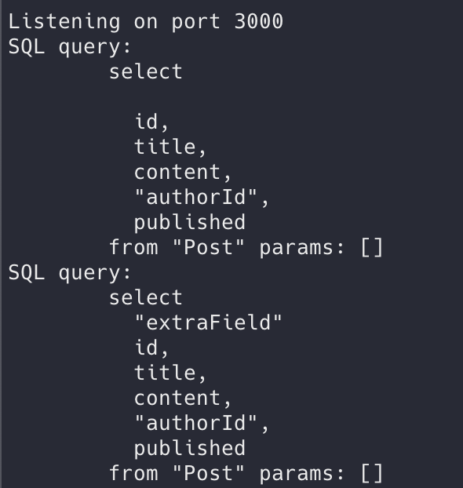
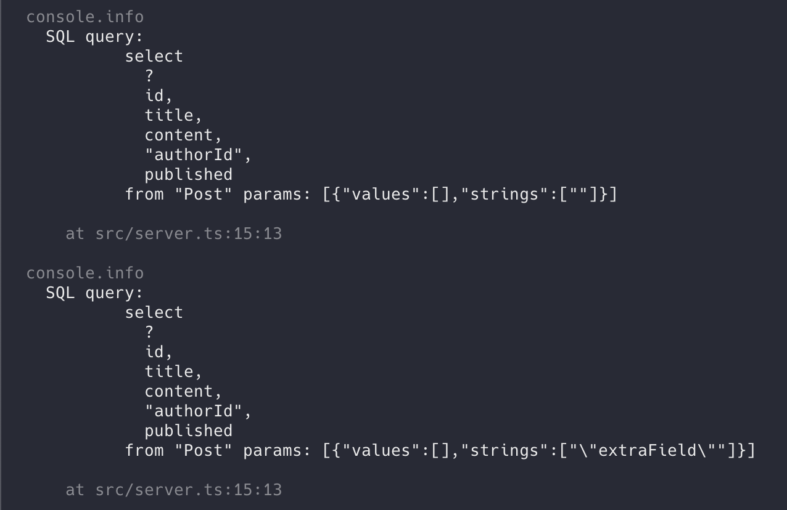

# Prisma Issue #11454

Repo to reproduce [issue #11454](https://github.com/prisma/prisma/issues/11454).

Main file is `src/server.ts`

### How to run server locally (all Prisma queries should work as expected):

1. `npm start`
2. `curl "http://localhost:3000/data"` to get data
3. `curl "http://localhost:3000/data?includeExtra=true"` to get data with extra info
4. Observe success, as it appends the string into the raw SQL

### How to run in Jest (all Prisma queries should fail unexpectedly)

1. `npm test`
2. Observe failure, as it attempts to use prepared statement

